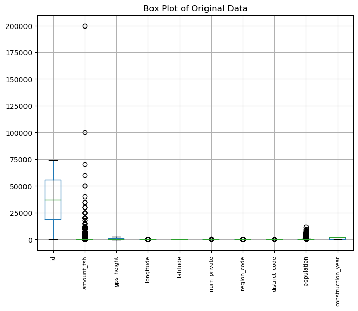
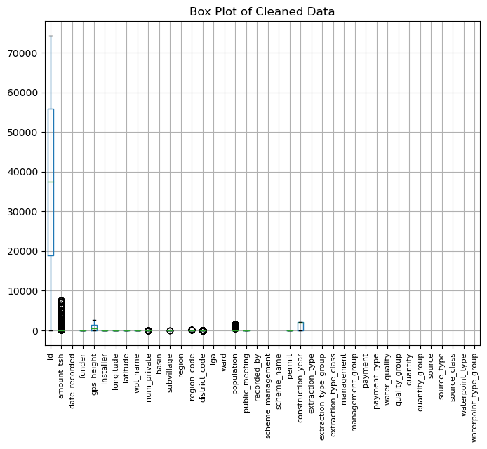
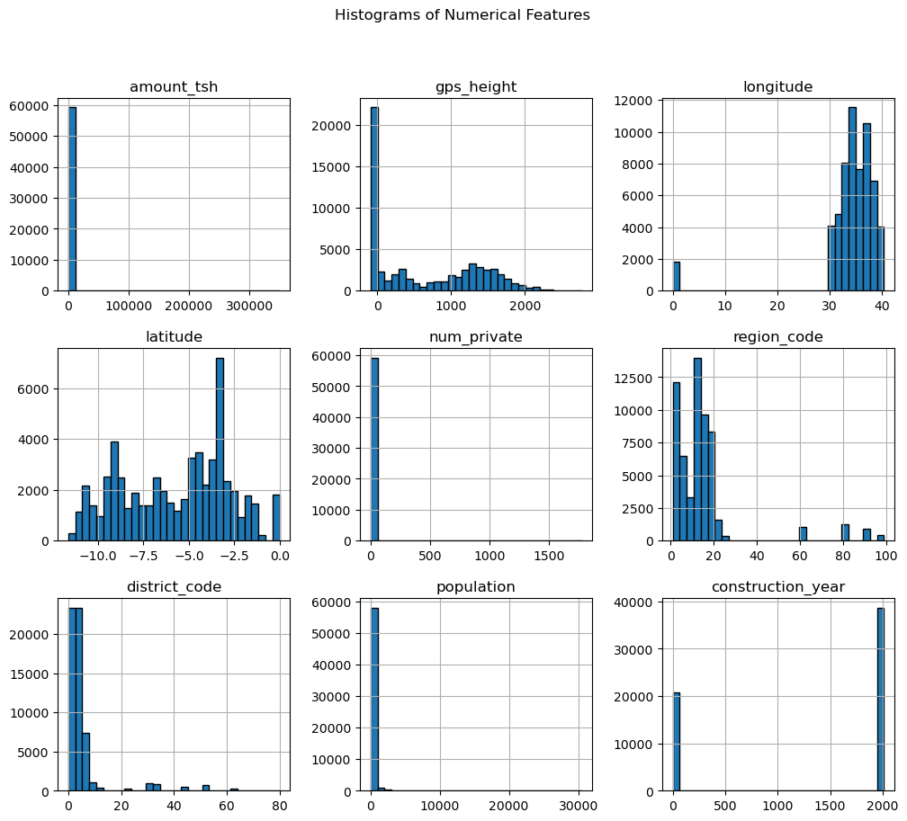
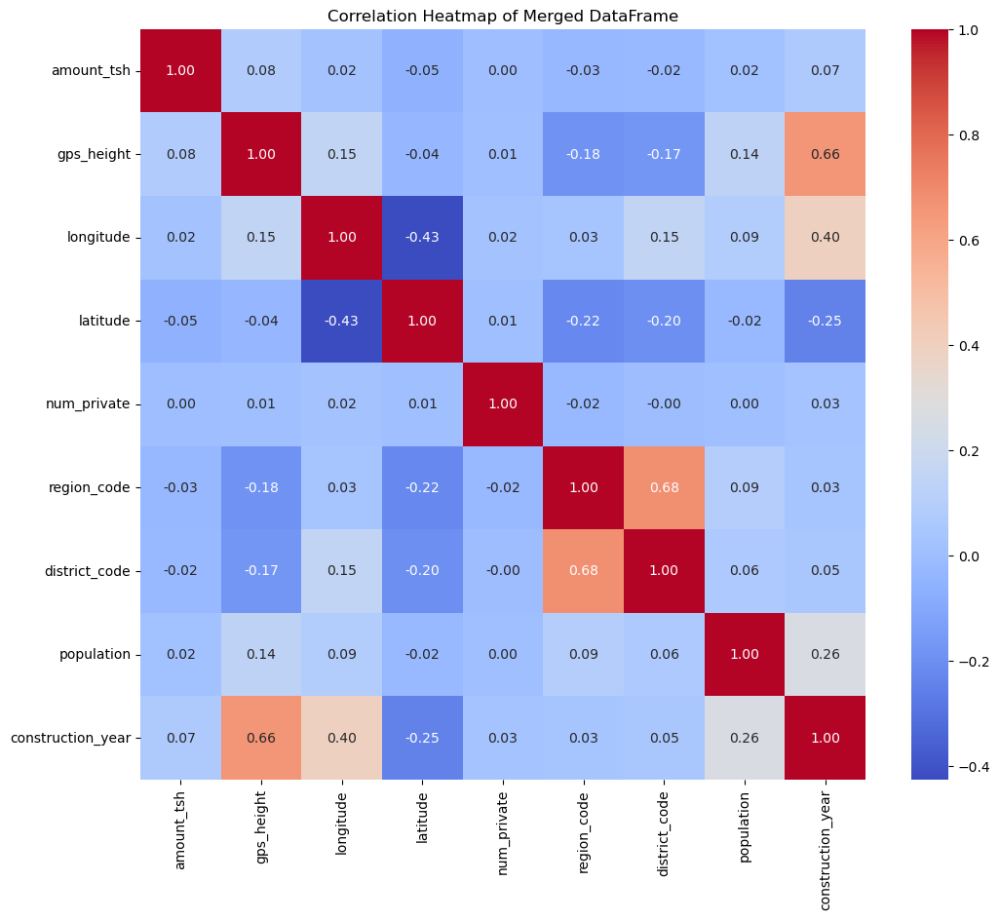
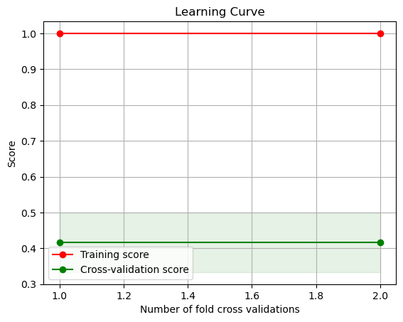
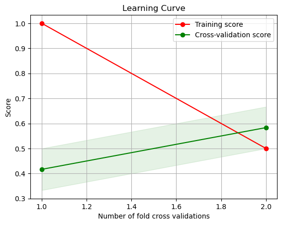
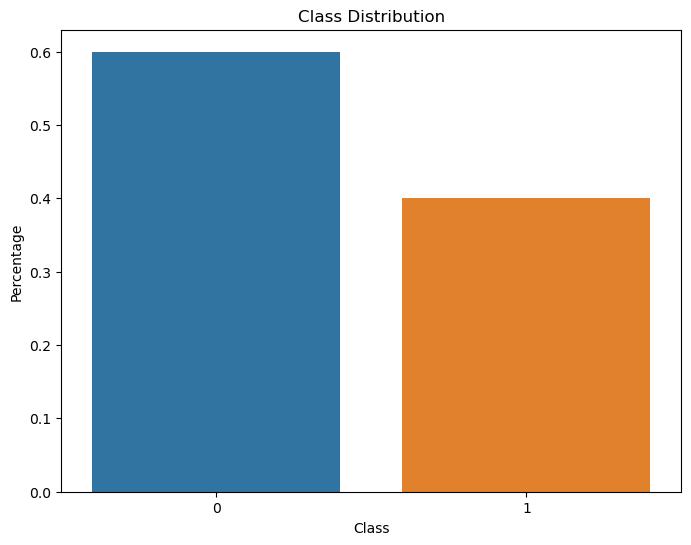
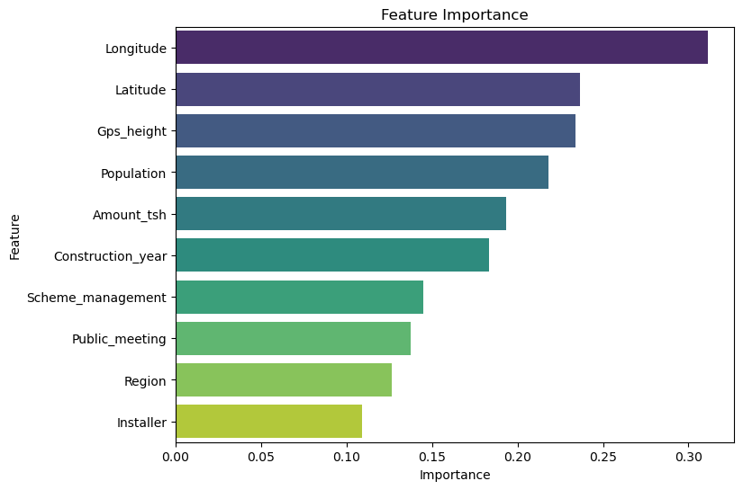
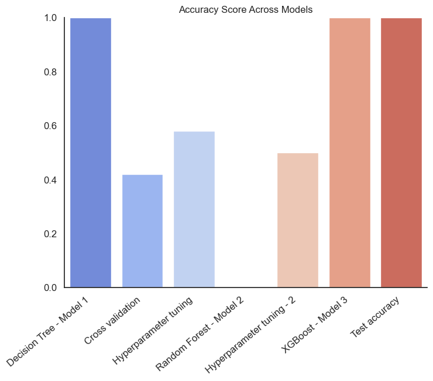

## Final Project Submission
## Please fill out:

## Student name: JACK OTIENO

## Student pace: full time

## Scheduled project review date/time:

## Instructor name: NIKITA NJOROGE

## Blog post URL:

## Table of Contents

## Business Problem

## Data Understanding

## Imports

## Data Cleaning

## Exploratory data analysis(EDA)

## Models

## Model 1 - Decision Tree Model

## Model 2 - Random Forest Model

## Model 3 - XGBoost Model

## Permutation Feature Importance

## Graphs for business presentation

## Conclusion

## Next Steps

## Improving Water Well Quality in Tanzania

## Overview

## Business problem

Tanzania, as a developing country, struggles with providing clean water to its population of over 57,000,000. There are many water points already established in the country, but some are in need of repair while others have failed altogether.We need to come up with a model that gives us the status of the wells. Using this model we can identify which wells need to be repaired.

## Problem statement

What are the critical factors influencing the functionality of water points in Tanzania? How can we accurately predict the status of a water point based on these factors? What data-driven strategies can be implemented to prioritize the repair of water points in the most critical condition?
By addressing these questions, we aim to enhance the management and sustainability of water resources in Tanzania, ultimately improving the quality of life for its citizens.

## Challenges

Some of the challenges faced by the Tanzania citizens include; A significant number of water points are in need of repair or having failed altogether. Variability in the quality of construction and materials used in different water points. Incomplete or inconsistent data on the status of water points. Lack of up-to-date information due to irregular maintenance checks and reporting.Limited financial and human resources to conduct repairs and maintenance.

## Proposed solution

I propose in use of machine learning techniques to create a predictive model that analyzes data to forecast water point failures and maintenance needs. This model can help prioritize which wells require immediate attention. I will ensure the predictive model integrates seamlessly with existing water management systems to provide actionable insights and facilitate proactive maintenance. Utilize the predictive model to allocate financial and human resources more effectively, focusing on water points that are most at risk of failure or in urgent need of repair.Develop and enforce guidelines for the construction and maintenance of water points to ensure uniformity in quality. This can reduce the variability in the quality of construction and materials used.Implement training and certification programs for local technicians and engineers to ensure they are skilled in best practices for constructing and maintaining water points.

## Objectives

Develop a robust database to collect, store, and manage data on the status of water points across Tanzania. Use machine learning to create a predictive model that forecasts water point failures and maintenance needs. Integrate the predictive model with existing water management systems for proactive maintenance planning. Utilize the predictive model to prioritize water points that require immediate attention.Develop and enforce guidelines for the construction and maintenance of water points to ensure uniform quality. Implement training and certification programs for local technicians and engineers.

## RESEARCH QUESTIONS THAT WOULD HELP ACHIEVE THE OBJECTIVES

1.How can a robust database be developed to effectively collect, store, and manage data on the status of water points across Tanzania? 

2.What machine learning techniques can be employed to create an accurate predictive model for forecasting water point failures and maintenance needs? 

3.How can the predictive model be integrated with existing water management systems to facilitate proactive maintenance planning? 

4.In what ways can the predictive model be used to prioritize water points that require immediate attention? 

5.What guidelines can be developed and enforced to ensure uniform quality in the construction and maintenance of water points? 

6.How can training and certification programs be implemented to equip local technicians and engineers with the skills needed for maintaining water points?

### DATA UNDERSTANDING

We have a data from 59.400 water wells on which we made our model. This data consists of various specifications such as who built the well, where is the well located, when it was built and what is the quality/quantity of the water. We are trying to understand if we can predict the status of the well from these specifications. We then compare our best model to another data of 1111 wells to which we do not know the status of the wells. With this we can see how succesful our model is when predicting unseen data.

## The Tanzania water wells dataset has the following column names;

1.id: Unique identifier for each well entry.

2.Amount_tsh: Amount of total static head (water available to draw) in liters.

3.Date_recorded: Date when the well data was recorded.

4.Funder: Organization or individual that funded the well.

5.Gps_height: Altitude of the well above sea level in meters.

6.Installer: Organization or individual that installed the well.

7.Longitude: Longitude coordinate of the well.

8.Latitude: Latitude coordinate of the well.

9.Wpt_name: Name of the water point (well).

10.Num_private: Number of private water points.

11.Basin: Basin where the water point is located.

12.Subvillage: Sub-village or neighborhood where the water point is located.

13.Region: Region where the water point is located.

14.Region_code: Code corresponding to the region.

15.District_code: Code corresponding to the district.

16.Iga: Local Government Area where the water point is located.

17.Ward: Ward where the water point is located.

18.Population: Population served by the water point.

19.Public_meeting: Whether a public meeting was held to discuss the water point (True/False).

20.Recorded_by: Name of the person or entity that recorded the data.

21.Scheme_management: Management scheme for the water point.

22.Scheme_name: Name of the management scheme.

23.Permit: Whether a permit exists for the water point (True/False).

24.Construction_year: Year the water point was constructed.

25.Extraction_type: Method of water extraction (e.g., hand pump, gravity).

26.Extraction_type_group: Group of extraction types (e.g., hand pump, motorized pump).

27.Extraction_type_class: Class of extraction method (e.g., hand pump, powered pump).

28.Management: Who manages the water point (e.g., community, government).

29.Management_group: Group of management types.

30.Payment: Payment structure for water usage (e.g., pay per bucket, monthly fee).

31.Payment_type: Type of payment structure.

32.Water_quality: Quality of water (e.g., good, salty, contaminated).

33.Quality_group: Group of water quality types.

34.Quantity: Quantity of water (e.g., dry, insufficient, seasonal).

35.Quantity_group: Group of water quantity types.

36.Source: Source of the water (e.g., spring, river, rainwater).

37.Source_type: Type of water source.

38.Source_class: Class of water source.

39.Waterpoint_type: Type of water point (e.g., well, borehole).

40.Waterpoint_type_group: Group of water point types

## X_test : X_test assigns the string ('well_test_labels.csv')to the X_test. 
It typically represents the test data features. The file well_test_labels.csv might contain features similar to well_features.csv but intended for testing the performance of the trained model.

## X_train : X_train assigns the string ('well_features.csv') to the variable X_train.
X_train typically represents the training data features in a machine learning context. The file well_features.csv likely contains various features (columns) of the water wells that will be used to train a model.

## y_train : This assigns the string ('well_labels.csv') to the variable y_train.
 The y_train usually represents the target label(status_group) for the training data. This feature is an indicator of whether or not the water well is 'functional', 'functional needs repairs', or 'non functional'.

# Import

We import the necessary functions

# Data cleaning

We clean the data in the following ways;
1.checking the data and missing values
impute value '50' to columns with missing values
2.checking for non-numeric columns
3.checking for duplicates
4.creating the necessary columns.
5.checking for outliers using the box plot and deleting the outliers

# Exploratory data analysis

In this section, we will perform exploratory data analysis (EDA) to understand the data better and discover any patterns, trends using bivariate and multivariate analysis

We will use descriptive statistics and visualizations to summarize the main characteristics of the data and examine the relationships between the features and the target variable.

We will also check the distribution and correlation of the variables and identify any potential problems or opportunities for the analysis.

## Bivariate analysis

In this section, we will perform bivariate analysis to examine the relationship between the target variable (status_group) and the other features in the data. We will use scatter plots to show the direction and strength of the relationship between two numeric variables. This will help us understand how one variable affects or is affected by another variable and identify any patterns or trends that may exist.

The scatter plots show that there is a positive relationship between some of the independent variables and the status_group. This means that most of the independent variables influence the status of the water wells in one way or the other.

## Multivariate analysis

In this section, we will perform multivariate analysis to examine the relationship between various variables in the data. We will use heatmap to visualize the correlation matrix of the features and see how they are related to each other and to the price.

A heatmap can show us the strength and direction of the correlation between two variables using different colors and shades. 

From the heatmap above,Positive correlations are typically represented by shades of red, and negative correlations by shades of blue. We note that district_code and region_code are highly positively correlated.

## Models

Throughout the modeling process, we ran models in an iterative process slowly tuning the hyper-parameters.
Below you can see the best results withn the hyper-parameters we tested for each model type.

## Model 1 - Decision Tree Model(Base Model)

The model achieves an accuracy of 1.0, it means that the model has perfectly predicted the target values on the test set. While this might sound ideal, it's often a sign that the model is overfitting, especially if your dataset is very small or if the test set is not representative of the real-world data.

## Cross validation and learning curves

We can use cross-validation to get a more reliable estimate of the model’s performance.

## Learning curve

From the above visualization, the model may be overfitting the training data. Overfitting occurs when the model captures noise or random fluctuations in the training data, leading to poor generalization to unseen data. In this scenario, the model performs extremely well on the training set (close to perfect accuracy, 1.0), but its performance significantly degrades on the validation set (much lower accuracy, 0.4). This large gap between the two lines suggests that the model has memorized the training data instead of learning generalizable patterns.

The model achieved accuracy scores of approximately 0.3333 and 0.5 on the two folds of stratified cross-validation.
The mean cross-validation accuracy, which is the average of these scores, is approximately 0.4167.
This means that, on average, the model correctly predicted the target variable for about 41.67% of the samples in the dataset during cross-validation. We can further improve the model in order to achieve a better Mean cross-validation accuracy through Hyperparameter tuning

## Hyperparameter tuning

Based on the results of the grid search with 2-fold cross-validation, the best parameters found for the Random Forest classifier (rf_clf) are:

max_depth: 3

min_samples_leaf: 1

min_samples_split: 5

The corresponding mean cross-validation accuracy achieved with these parameters is approximately 0.5833, or 58.33%. You will notice that there is a slight improvement in the Mean Cross-validation accuracy as compared to the previous value which had an accuracy of 0.41767 or 41.767% thus can help the model carry out a better predictions.

## Learning curve

At the point of intersection, the model's complexity seems to be appropriate for the amount of data available. Both the training and validation performance are similar, indicating that the model generalizes well to unseen data. This scenario implies that the model is neither underfitting nor overfitting the data.

## Model 2 - Random Forest Model

The model obtains an  accuracy score of 0.0. This typically means that the model is predicting all instances incorrectly.It could be due to various reasons:Data imbalance, Overfitting, Incorrect data preprocessing or even insufficient data.We can check for class imbalance to see if it the main issue that contributes to the Model accuracy score of 0.0

## class imbalance

Given this distribution, class imbalance might not be the primary reason for the model's accuracy of 0.0. We should investigate other potential issues such as data preprocessing, model hyperparameters, or bugs in the code.

## Hyperparameter tuning

It seems that hyperparameter tuning has resulted in a slight improvement in accuracy, but it's still not satisfactory. The best hyperparameters found through grid search are:

max_depth: 3

min_samples_leaf: 1

min_samples_split: 5

With these hyperparameters, the best accuracy achieved on the training data during cross-validation is 0.5 or 50%

## Model 3 - XGBOOST Model

An accuracy of 1.0 indicates that your XGBoost model predicted all the test samples correctly. This is a perfect accuracy score, suggesting that your model performed exceptionally well on the test data. However, it's essential to ensure that such high accuracy is not due to overfitting.

## check for overfitting

Obtaining a testing accuracy of 1.0 indicates that your model has performed perfectly on the unseen testing data. This means that the model can carry out better predictions.

## class imbalance

From the above visualization, there is class imbalance. Specifically:

The longer bar represents the majority class, which has a higher number of samples or instances.

The shorter bar represents the minority class, which has a lower number of samples or instances.

Given this distribution, class imbalance might not have an impact in the performance of the model since the model has performed well on the unseen testing data.

## Permutation Feature Importance

From the above visualization we get to see that the most important feature is the Longitude.Longitude is very critical for geographical location thus it can affect the water levels in the wells. The least important feature is the installer.The skill and reliability of the installer can impact the initial setup quality, though it's often less critical than ongoing factors such as Latitude and Longitude.

## Graphs for Business Presentation

## CONCLUSION

This analysis gives as three recommendations from our water wells project;

## What are the critical factors influencing the functionality of water points in Tanzania?

Given the critical factors influencing the functionality of water points in Tanzania, such as longitude and latitude, here's a recommendation for the government:

1.Investment in Geospatial Data Analysis: The government should prioritize investment in geospatial data analysis tools and expertise to leverage the geographical information available. This includes utilizing geographic information systems (GIS) to analyze the distribution of water points across different regions, identify areas with high water stress or vulnerability, and assess the impact of geographical factors like longitude and latitude on water availability and quality.

2.Infrastructure Planning and Development: Based on the analysis of geographical data, the government can develop targeted infrastructure plans for water point installation and maintenance. This includes identifying suitable locations for new water points based on factors like proximity to water sources, population density, and terrain characteristics. Additionally, the government can prioritize maintenance efforts for existing water points in areas prone to environmental challenges or where water availability is most critical.

3.Community Engagement and Capacity Building: Engage local communities in the planning, implementation, and management of water point infrastructure. This involvement can help ensure that water points are located in areas that meet the needs and preferences of local residents and that communities are equipped with the knowledge and skills to maintain and manage water points effectively.

4.Integration of Technology and Innovation: Explore the integration of innovative technologies, such as remote sensing and real-time monitoring systems, to improve the management and maintenance of water points. These technologies can provide valuable data on water availability, usage patterns, and infrastructure performance, allowing for proactive maintenance and timely intervention in case of issues.

5.Collaboration with Stakeholders: Foster collaboration and partnerships with relevant stakeholders, including non-governmental organizations such as UNICEF, international agencies, and private sector entities, to leverage resources, expertise, and best practices in water resource management. By working together, the government can achieve greater impact and sustainability in ensuring access to safe and reliable water for all citizens.

## How can we accurately predict the status of a water point based on these factors? 
We can use the XGBoost Model which is 100% accurate on unseen data.

## What data-driven strategies can be implemented to prioritize the repair of water points in the most critical condition?

1.Data Collection and Monitoring: Implement a comprehensive data collection and monitoring system that continuously collects data on the status of water points, including longitude, latitude, and other relevant factors such as pump age, water table levels, and maintenance history.

2.Feature Engineering: Utilize advanced feature engineering techniques to extract meaningful features from the collected data, such as distance from major water sources, population density in the area, and socio-economic factors.

3.Predictive Modeling: Develop predictive models, such as the XGBoost model, using historical data on water point functionality and relevant features. Train the model to accurately predict the status of a water point (functional, needs repair, non-functional) based on its geographical location (longitude and latitude) and other critical factors.

4.Prioritization Algorithm: Develop a prioritization algorithm that ranks water points based on their predicted status and the severity of their condition. Consider factors such as the population served by the water point, the availability of alternative water sources, and the potential impact on public health.

5.Resource Allocation: Allocate repair and maintenance resources based on the prioritized list generated by the algorithm. Focus resources on repairing water points that are predicted to be non-functional or in critical condition, particularly those serving communities with limited access to alternative water sources.

6.Continuous Improvement: Continuously evaluate the performance of the predictive model and the prioritization algorithm based on real-world data. Incorporate feedback from field workers and community members to improve the accuracy and effectiveness of the strategies over time.

## Next steps

1.How can we improve our model?
I encountered issues with cross validation number of folds. The recommended number of folds is 5 but for my dataset it had only 2 folds.Increasing the data size or using stratified cross validation can improve the model thus we can get better predictions.

2.What is the status of non-functional wells?
We can anayze non-functional wells to see which can be rebuilt and which ones are gone for good.
We can conduct a census change to see how the need for wells has changed from region to region.

3.Plan for the future.
Population of Tanzania has been increasing rapidly for a while now. Instead of only planning for today we can get future prediction data for census and plan ahaed.

4.Carry out an analysis to identify why wells are non-functional.
We can analyze the non-functional wells to see what went wrong. Get more data on the quantity of water to figure out why wells are becoming dry.

